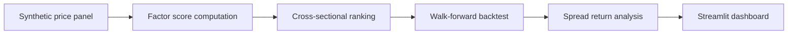

# Quant Research Lab

Public-facing research-platform showcase inspired by the systems work I led at
Algory Capital.

## Project framing

This repo is an original demo of a leakage-aware quant research workflow:
ingest data, build factors, run walk-forward backtests, inspect diagnostics,
and present the results in a lightweight research dashboard.

## What it demonstrates

- factor generation over a synthetic asset universe
- walk-forward validation discipline
- ranking and portfolio spread construction
- dashboard-first research ergonomics
- clear separation between research logic and presentation

## Stack

- Python
- pandas and NumPy
- Streamlit

## Research flow



## Repository map

- `src/factors.py` builds the synthetic data universe and composite factors
- `src/backtest.py` runs the walk-forward backtest
- `app.py` renders the Streamlit dashboard
- `tests/test_backtest.py` verifies the factor and backtest pipeline
- `examples/sample_backtest.csv` shows representative spread output

## Quickstart

```bash
python -m venv .venv
source .venv/bin/activate
pip install -r requirements.txt
streamlit run app.py
```

## Resume-aligned highlights

- shows the research-platform mentality behind the resume bullets
- foregrounds leakage awareness and walk-forward structure
- turns a leadership bullet into something inspectable and technical

## Next upgrades

- add sector exposures and residualization
- introduce tearsheet generation
- support alternative factor families and experiment tracking
