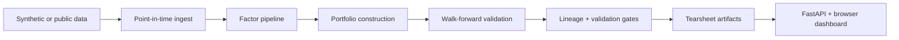

# Quant Research Lab

Public-facing research-platform showcase inspired by the systems work I led at
Algory Capital.

## Project framing

This repo is an original, public-facing simulation of the kind of research
platform a quantitative investment team uses to go from raw data to a reviewed
portfolio thesis. It expands the earlier factor demo into a fuller research
engineering system with scenario definitions, point-in-time data contracts,
factor construction, portfolio formation, exposure diagnostics, attribution,
validation gates, universe filtering, execution simulation, experiment lineage,
tearsheets, API endpoints, CI, and a browser dashboard.

## What it demonstrates

- leakage-aware factor research over a synthetic multi-sector equity universe
- walk-forward validation with transaction costs, turnover, and benchmark spread
- multiple strategy scenarios, including sector-neutral quality/value, regime
  overlays, earnings-revision-style sleeves, and liquidity-resilience bars
- portfolio construction, exposure diagnostics, and researcher-friendly
  tearsheet artifacts
- explicit universe filtering and execution-cost diagnostics so tradeability is
  visible instead of implied
- experiment lineage across scenario config, dataset snapshot, factor-library
  versioning, and artifacts
- run-level validation gates for turnover, drawdown, beta neutrality, sector
  concentration, and signal quality
- a FastAPI backend and front-end dashboard for launching, replaying,
  comparing, and auditing experiments
- public dataset adapters for Fama-French and FRED sources plus deploy-ready CI

## Stack

- Python
- FastAPI
- pandas and NumPy
- vanilla HTML, CSS, and JavaScript
- JSON-backed experiment storage
- GitHub Actions
- deploy-ready Docker and Render config

## Research flow



## Repository map

- `src/data.py` builds the synthetic market panel and downloads public datasets
- `src/factors.py` computes cross-sectional factor signals and regime overlays
- `src/portfolio.py` constructs long-short books with turnover-aware sizing
- `src/universe.py` applies price, liquidity, and volatility filters while
  recording retention diagnostics
- `src/execution.py` estimates ADV participation, fill ratios, and
  implementation shortfall
- `src/backtest.py` runs scenario backtests and calculates performance metrics
- `src/lineage.py` fingerprints experiment configuration and dataset snapshots
- `src/validation.py` records promotability gates and risk controls
- `src/attribution.py` summarizes factor and sector contribution
- `src/platform.py` defines the research-platform surface exposed to the app
- `src/artifacts.py` writes tearsheet charts, manifests, and tabular outputs
- `src/lab.py` defines the research scenarios exposed through the app
- `app/main.py` exposes the API and serves the dashboard
- `app/static/` contains the front-end interface
- `scripts/benchmark_quant_lab.py` generates the sample outputs in `examples/`
- `scripts/download_public_data.py` fetches normalized public datasets
- `scripts/export_platform_snapshot.py` exports the static platform definition
- `scripts/smoke_hosted_demo.py` smoke-tests a local or hosted deployment
- `.github/workflows/ci.yml` runs the public CI suite
- `tests/` covers the research engine and API surface

## Quickstart

```bash
python -m venv .venv
source .venv/bin/activate
pip install -r requirements.txt
uvicorn app.main:app --reload
```

Then open `http://127.0.0.1:8000`.

## Benchmark scenarios

- `quality_value_sector_neutral`
  - sector-neutral composite that blends value, quality, and profitability
- `momentum_regime_overlay`
  - momentum sleeve with macro-risk gating and turnover-aware sizing
- `defensive_quality_low_vol`
  - defensive portfolio that leans on quality, stability, and balance-sheet
    resilience
- `earnings_revision_quality`
  - revision-style sleeve that blends quality, profitability, and faster trend
- `liquidity_resilience_barbell`
  - barbell sleeve balancing resilient quality against stressed cheapness with
    liquidity guards

## Artifacts

Each research run produces:

- `report.json`
- `summary.md`
- `research_brief.md`
- `lineage.json`
- `validation_report.json`
- `platform_summary.json`
- `universe_audit.json`
- `execution_summary.json`
- `factor_attribution.csv`
- `sector_attribution.csv`
- `equity_curve.svg`
- `drawdown.svg`
- `factor_exposures.svg`
- `sector_tilts.svg`
- `ic_trace.svg`
- `capacity_profile.svg`
- `slippage_profile.svg`
- `universe_retention.svg`
- `execution_profile.csv`
- `universe_audit.csv`
- `holdings.csv`
- `period_returns.csv`
- `manifest.json`

## Platform surface

The repo now exposes `GET /api/platform` and `GET /api/research-ops` endpoints,
plus matching dashboard panels, to make the systems layer visible:

- point-in-time ingestion contracts
- experiment tracker and replay lineage
- validation suite with risk gates
- universe filter retention and execution budgets
- tear-sheet service and artifact bundle

That is deliberate. The goal is for the GitHub repo to reflect research-platform
engineering, not just a backtest notebook.

## Public data hooks

The repo includes tested download adapters for:

- Kenneth French factor library
- FRED macro rate series
- FRED market proxy series

Use:

```bash
python scripts/download_public_data.py --dataset fama_french_daily_3_factor
```

I also smoke-tested the FRED path with:

```bash
python scripts/download_public_data.py --dataset fred_macro_core
```

## Validation

```bash
.venv/bin/python -m pytest -q
.venv/bin/python -m compileall app src scripts tests
.venv/bin/python scripts/benchmark_quant_lab.py
.venv/bin/python scripts/export_platform_snapshot.py
.venv/bin/python scripts/smoke_hosted_demo.py http://127.0.0.1:8000
```

## Current sample benchmark snapshot

Latest generated sample metrics:

- Earnings Revision + Quality: `sharpe=1.60`, `return=7.90%`,
  `slippage=5.46bps`, `eligible_universe=30`, `readiness=82.6`
- Momentum with Regime Overlay: `sharpe=0.75`, `return=2.98%`,
  `slippage=5.48bps`, `eligible_universe=30`, `readiness=64.6`

That gives the repo a stronger public story around research readiness: not just
alpha and Sharpe, but whether a sleeve survives universe filters, execution
budgets, and validation gates.

## Resume-aligned highlights

- turns research infrastructure work into an inspectable product surface
- foregrounds walk-forward discipline, experiment lineage, and validation depth
- adds the missing research-platform details from the resume: execution
  simulation, universe filtering, and operational review metrics
- mirrors the kind of platform responsibilities described on my resume:
  point-in-time data, factor modeling, backtesting, portfolio construction,
  tearsheets, experiment tracking, exposure control, and CI
- keeps the portfolio-construction story concrete without exposing proprietary
  employer IP
