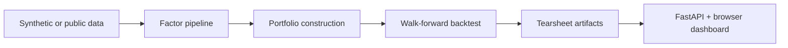

# Quant Research Lab

Public-facing research-platform showcase inspired by the systems work I led at
Algory Capital.

## Project framing

This repo is an original, public-facing simulation of the kind of research
platform a quantitative investment team uses to go from raw data to a reviewed
portfolio thesis. It expands the earlier factor demo into a full-stack research
lab with scenario definitions, factor construction, portfolio formation,
tearsheets, experiment storage, API endpoints, a browser dashboard, and
public-data hooks for offline benchmarking.

## What it demonstrates

- leakage-aware factor research over a synthetic multi-sector equity universe
- walk-forward validation with transaction costs, turnover, and benchmark spread
- multiple strategy scenarios, including sector-neutral quality/value and regime
  overlays
- portfolio construction, exposure diagnostics, and researcher-friendly
  tearsheet artifacts
- a FastAPI backend and front-end dashboard for launching, replaying, and
  comparing experiments
- public dataset adapters for Fama-French and FRED sources

## Stack

- Python
- FastAPI
- pandas and NumPy
- vanilla HTML, CSS, and JavaScript
- JSON-backed experiment storage with deploy-ready Docker and Render config

## Research flow



## Repository map

- `src/data.py` builds the synthetic market panel and downloads public datasets
- `src/factors.py` computes cross-sectional factor signals and regime overlays
- `src/portfolio.py` constructs long-short books with turnover-aware sizing
- `src/backtest.py` runs scenario backtests and calculates performance metrics
- `src/artifacts.py` writes tearsheet charts, manifests, and tabular outputs
- `src/lab.py` defines the research scenarios exposed through the app
- `app/main.py` exposes the API and serves the dashboard
- `app/static/` contains the front-end interface
- `scripts/benchmark_quant_lab.py` generates the sample outputs in `examples/`
- `scripts/download_public_data.py` fetches normalized public datasets
- `tests/` covers the research engine and API surface

## Quickstart

```bash
python -m venv .venv
source .venv/bin/activate
pip install -r requirements.txt
uvicorn app.main:app --reload
```

Then open `http://127.0.0.1:8000`.

## Benchmark scenarios

- `quality_value_sector_neutral`
  - sector-neutral composite that blends value, quality, and profitability
- `momentum_regime_overlay`
  - momentum sleeve with macro-risk gating and turnover-aware sizing
- `defensive_quality_low_vol`
  - defensive portfolio that leans on quality, stability, and balance-sheet
    resilience

## Artifacts

Each research run produces:

- `report.json`
- `summary.md`
- `equity_curve.svg`
- `drawdown.svg`
- `factor_exposures.svg`
- `sector_tilts.svg`
- `holdings.csv`
- `period_returns.csv`
- `manifest.json`

## Public data hooks

The repo includes tested download adapters for:

- Kenneth French factor library
- FRED macro rate series
- FRED market proxy series

Use:

```bash
python scripts/download_public_data.py --dataset fama_french_daily_3_factor
```

## Validation

```bash
pytest -q
python -m compileall app src scripts tests
python scripts/benchmark_quant_lab.py
python scripts/smoke_hosted_demo.py http://127.0.0.1:8000
```

## Resume-aligned highlights

- turns research infrastructure work into an inspectable product surface
- foregrounds walk-forward discipline, researcher velocity, and diagnostic depth
- makes the portfolio-construction story concrete without exposing proprietary
  employer IP
